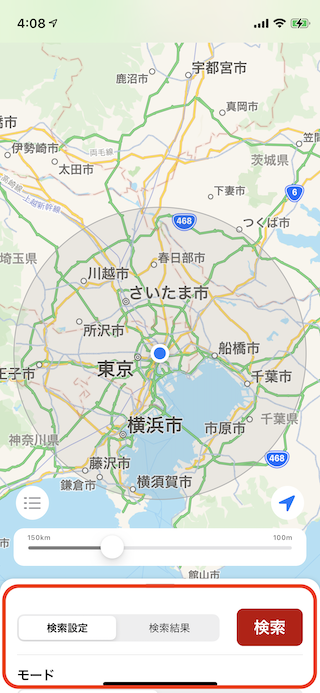
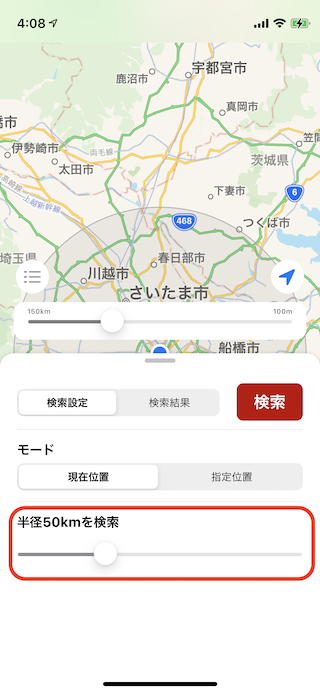
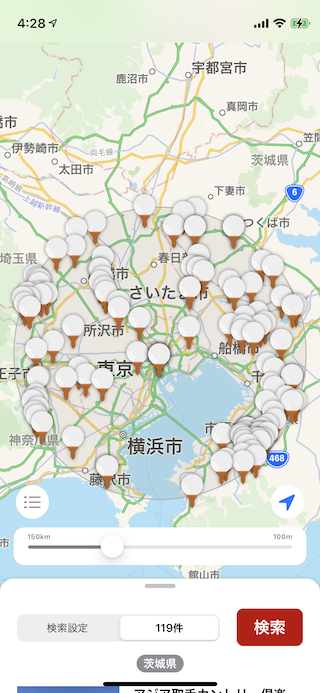
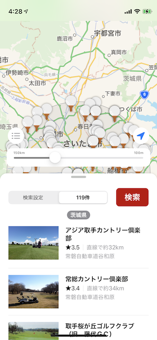
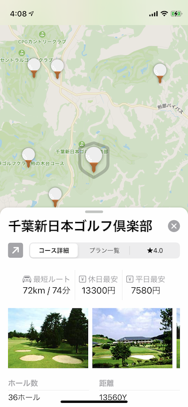
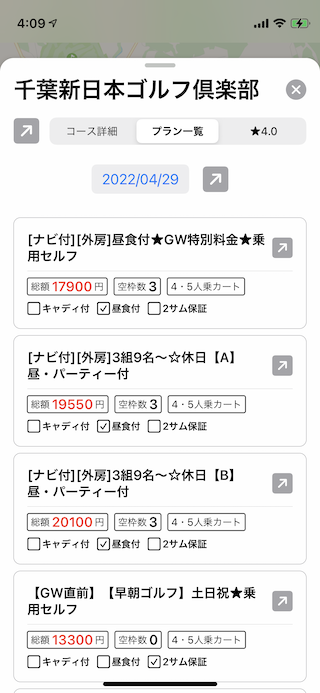

# まずはじめに

GoogoraMapは楽天GORAの検索情報を利用して、地図で範囲を指定してゴルフ場を検索するアプリです。
ゴルフ場を検索するだけではなく、詳細画面でプランの一覧を確認したり、予約をすることもできます。

## 使い方

### 検索設定を表示

まずは、赤く囲われている画面下の検索バーを上にスワイプしてみましょう。
上にスワイプすることで、検索設定を表示されます。

### 検索範囲を設定

検索設定では、現在位置または指定位置からの検索範囲の半径を指定できるスライダーがあります。
スライダーを調整して、検索範囲を指定してみましょう。

### 検索結果の表示

検索ボタンをタップすると、地図上または画面下部の検索結果一覧に検索結果が表示されます。

地図 | 検索結果
:-: | :-:
 | 

### 詳細画面の表示

地図上または画面下部の検索結果一覧からゴルフ場を選択することで詳細画面を開くことができます。
詳細画面では、現在位置または指定した位置からゴルフ場までの推定距離と移動時間を表示する独自機能や、コースに関する基本的な情報が表示されます。

### プランの確認と予約

詳細画面ではプランを確認することができるので、プレー日を指定してプランを表示してみましょう。
表示されたプランを選択すると、内部ブラウザで楽天GORAの予約ページが開かれるので、そちらからプランを予約することもできます。

